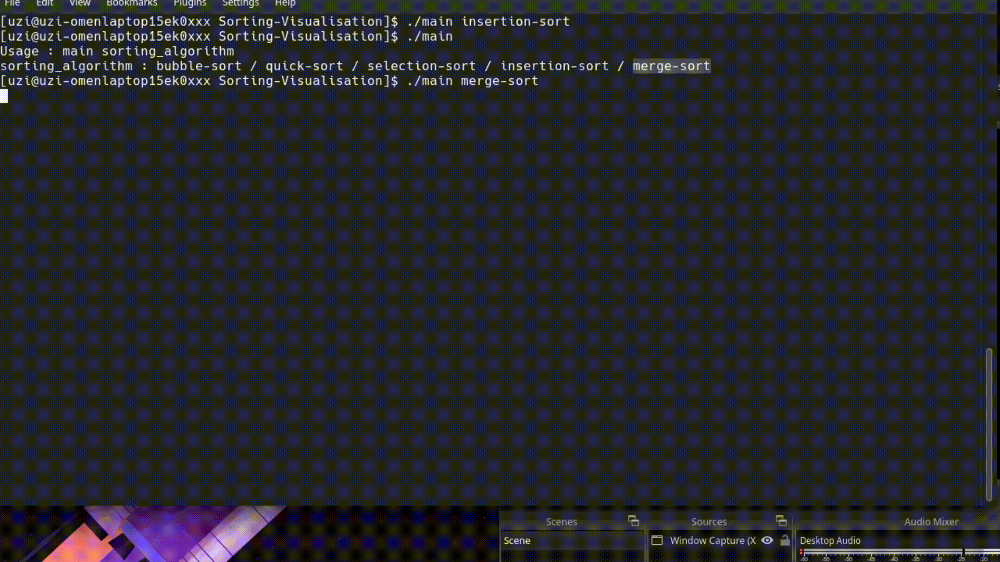
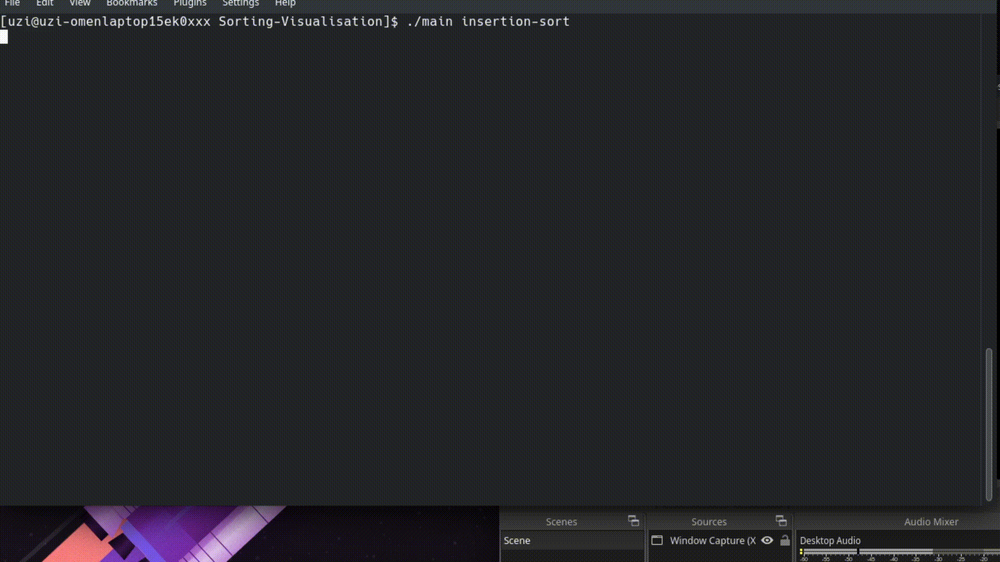
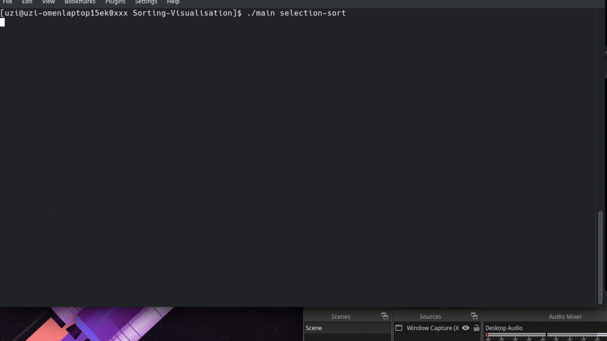

# Sorting-Visualisation

```
make

./main sorting_algorithm
sorting_algorithm : bubble-sort / quick-sort / selection-sort / insertion-sort / merge-sort
```

## bubble sort 
$O(n^2)$


## merge sort 
$O(n log n)$


## insertion sort
$O(n^2)$


## quick sort
$O(log n)$


## selection sort
$O(n^2)$
